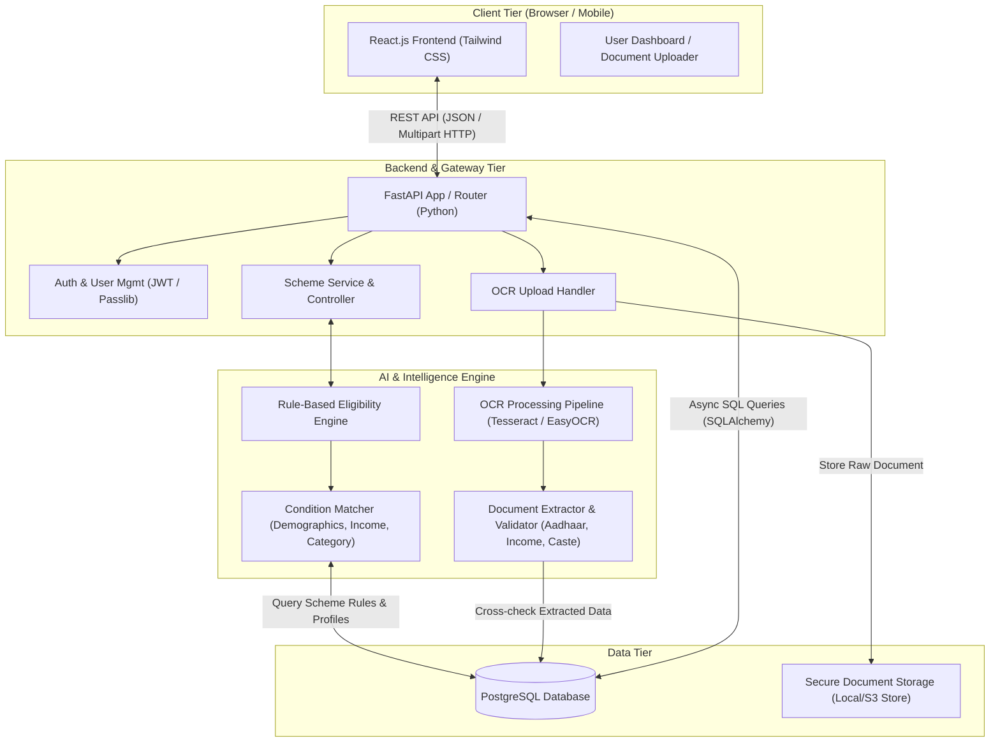
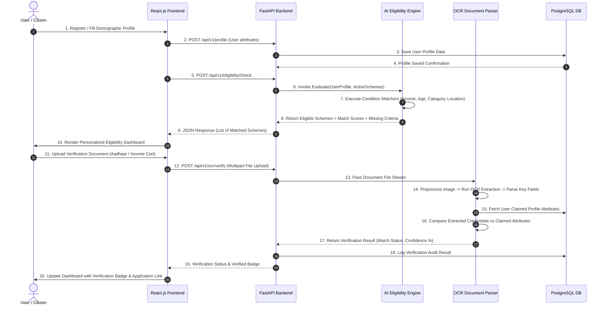
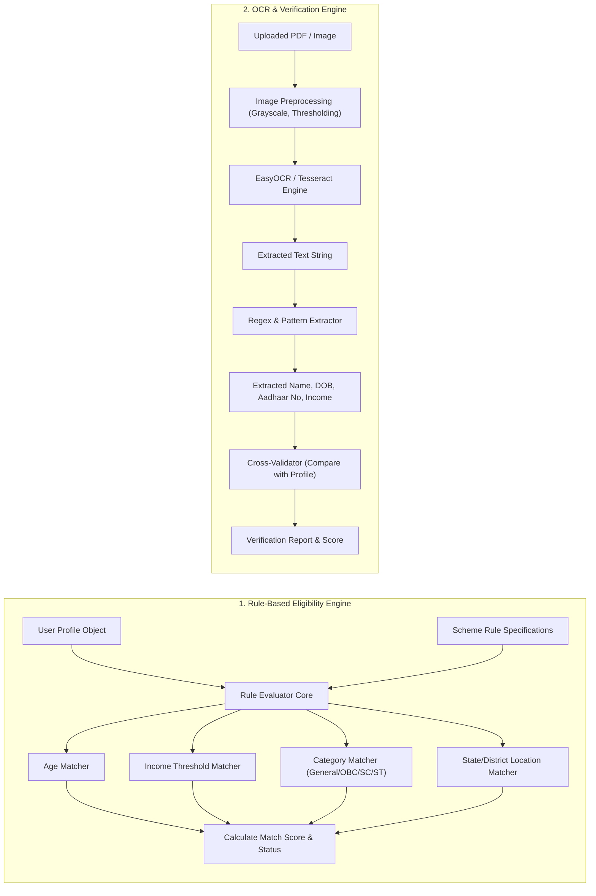
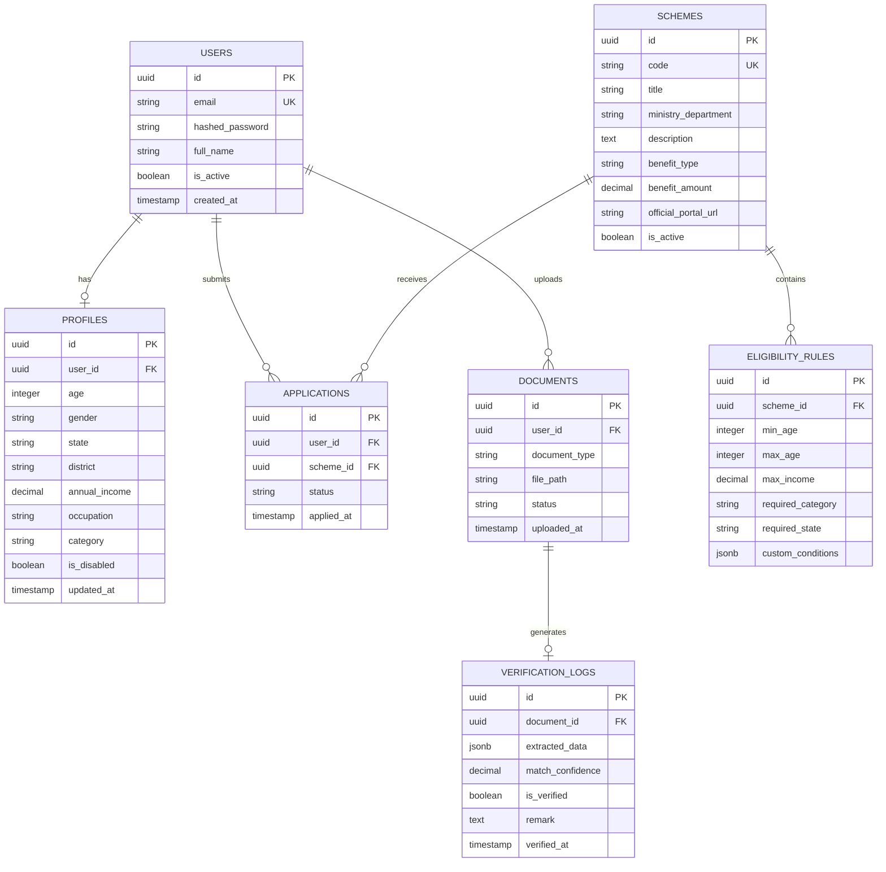
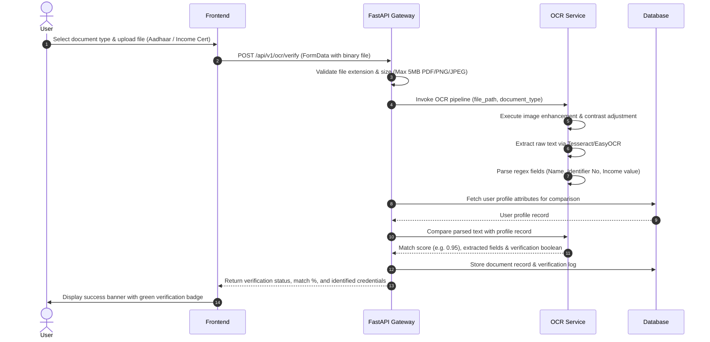

# ARCHITECTURE.md — Eligify

> **Project Name:** Eligify  
> **System Architecture Specification**  
> **Version:** 1.0.0  

---

## 1. Overall System Architecture

Eligify follows a decoupled **3-Tier Architecture** consisting of a React.js Single Page Application (Frontend), a high-performance FastAPI API Gateway/Backend, a specialized Python AI Engine (Rule Evaluator & OCR Document Parser), and a PostgreSQL Relational Database.

### 1.1 Architecture Block Diagram



---

## 2. Module Descriptions

| Module | Location | Primary Responsibilities |
| :--- | :--- | :--- |
| **Frontend UI** | `frontend/` | Renders user registration, profile form, scheme discovery dashboard, eligibility breakdown cards, and document upload wizard. |
| **API Gateway & Auth** | `backend/app/api/` | Handles client requests, user authentication (JWT), request validation (Pydantic), and endpoint routing. |
| **User & Profile Service** | `backend/app/services/` | Manages demographic attributes (age, state, gender, annual income, occupation, category, disability status). |
| **Rule-Based Eligibility Engine** | `ai_engine/rules/` | Evaluates user profile attributes against scheme qualification criteria matrices and generates match confidence scores. |
| **OCR Document Parser** | `ai_engine/ocr/` | Applies image preprocessing, text extraction via OCR, regex pattern matching, and credential verification against claimed profile values. |
| **Database Access Layer** | `backend/app/core/database.py` | Asynchronous connection pooling and ORM models mapping to PostgreSQL tables. |

---

## 3. Data Flow

### 3.1 End-to-End Application Workflow



---

## 4. Backend Architecture

FastAPI serves as the asynchronous backend API layer, structured following clean architecture principles.

```text
backend/app/
├── api/
│   ├── endpoints/
│   │   ├── auth.py         # POST /register, POST /login, GET /me
│   │   ├── users.py        # GET/PUT /profile
│   │   ├── schemes.py      # GET /schemes, GET /schemes/{id}
│   │   ├── eligibility.py  # POST /check, GET /my-recommendations
│   │   └── ocr.py          # POST /upload-verify
│   └── router.py           # Main APIRouter bundling all endpoints
├── core/
│   ├── config.py           # Settings management via pydantic-settings
│   ├── database.py         # SQLAlchemy async engine & sessionmaker
│   └── security.py         # JWT creation, password hashing (bcrypt)
├── models/                 # SQLAlchemy ORM models
├── schemas/                # Pydantic schemas for request/response serialization
└── services/               # Core business services
```

### 4.1 Dependency Injection & Layer Separation
- **Endpoints (Controllers):** Handle HTTP status codes, request parsing, and invoke service methods.
- **Service Layer:** Houses domain logic, orchestrates calls between database models and the `ai_engine`.
- **Repository / Database Layer:** Interacts with PostgreSQL using async SQLAlchemy ORM queries.

---

## 5. AI Module Architecture

The AI module consists of two decoupled sub-systems: the **Eligibility Engine** and the **OCR Document Verification Engine**.



### 5.1 Eligibility Evaluation Matrix
The evaluation engine runs rule checks where each criterion produces:
- `STATUS`: `MATCHED`, `FAILED`, `CONDITIONALLY_MATCHED`
- `CONFIDENCE_SCORE`: Decimal (0.0 to 1.0)
- `REASON`: Clear human-readable message explaining why a user qualifies or fails (e.g., *"Annual income ₹1.5L is below the maximum scheme threshold of ₹2.5L"*).

### 5.2 OCR Pipeline Details
1. **Preprocessing:** Contrast stretching, noise reduction, and binarization via OpenCV.
2. **Text Extraction:** Optical Character Recognition using EasyOCR / Tesseract.
3. **Pattern Parser:** Customized Regular Expressions (Regex) to pull key identifiers:
   - Aadhaar Number (`\d{4}\s\d{4}\s\d{4}`)
   - Date of Birth / Year of Birth (`DOB:\s*\d{2}/\d{2}/\d{4}`)
   - Income Amount (`Annual Income:\s*₹?\s*[\d,]+`)
4. **Verification Matching:** String distance algorithms (e.g., Levenshtein distance) to compare extracted document text against user profile entries.

---

## 6. Frontend Architecture

The frontend is built using React.js with Tailwind CSS, utilizing a component-driven architecture with clean state management.

```text
frontend/src/
├── components/
│   ├── common/             # Navbar, Footer, LoadingSpinner, Badge
│   ├── dashboard/          # SchemeCard, EligibilityMeter, DocumentStatus
│   ├── profile/            # ProfileFormWizard, AttributeSelector
│   └── ocr/                # FileUploader, VerificationResultModal
├── context/
│   ├── AuthContext.js      # User authentication context & token handling
│   └── SchemeContext.js    # Active scheme list & user filter state
├── pages/
│   ├── HomePage.js         # Landing page & feature highlights
│   ├── LoginPage.js        # Auth login/registration page
│   ├── ProfilePage.js      # User demographic setup wizard
│   ├── DashboardPage.js    # Matched schemes overview
│   └── VerificationPage.js # OCR Document upload & verification
├── services/
│   ├── api.js              # Base Axios instance with auth headers
│   ├── authService.js      # Login/Register API calls
│   ├── schemeService.js    # Fetch schemes & eligibility checks
│   └── ocrService.js       # Multipart document upload API calls
└── App.js                  # React Router configuration
```

---

## 7. Database Overview

Eligify uses PostgreSQL as its primary database. Below is the Entity-Relationship (ER) schema design.



---

## 8. API Interaction Flow

### 8.1 Core API Endpoints

| Method | Endpoint | Description | Request Body / Params | Response |
| :--- | :--- | :--- | :--- | :--- |
| `POST` | `/api/v1/auth/register` | Register new user | `{email, password, full_name}` | `{user_id, email, token}` |
| `POST` | `/api/v1/auth/login` | User authentication | `{username, password}` | `{access_token, token_type}` |
| `GET` | `/api/v1/profile` | Retrieve user profile | Header: `Bearer <token>` | `UserProfileResponse` schema |
| `PUT` | `/api/v1/profile` | Update profile attributes | `UserProfileCreate` schema | Updated `UserProfileResponse` |
| `GET` | `/api/v1/schemes` | List all available schemes | Query: `?state=X&category=Y` | `List[SchemeResponse]` |
| `POST` | `/api/v1/eligibility/check` | Evaluate scheme eligibility | Header: `Bearer <token>` | `EligibilityEvaluationResponse` |
| `POST` | `/api/v1/ocr/verify` | Upload document & run OCR | `Multipart Form (file, doc_type)` | `OCRVerificationResponse` |

### 8.2 Sequence Diagram: Document Upload & OCR Verification Flow


