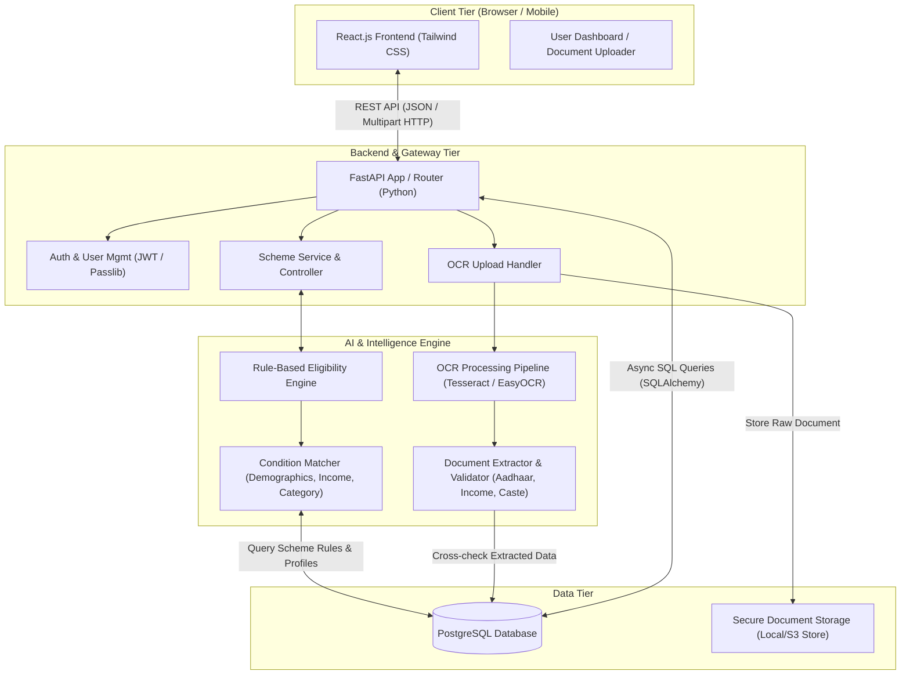
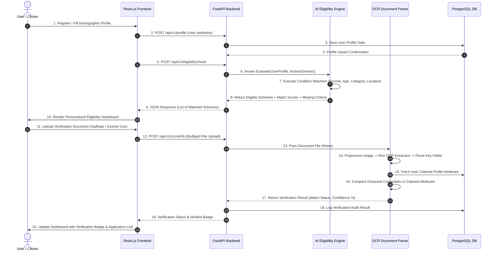
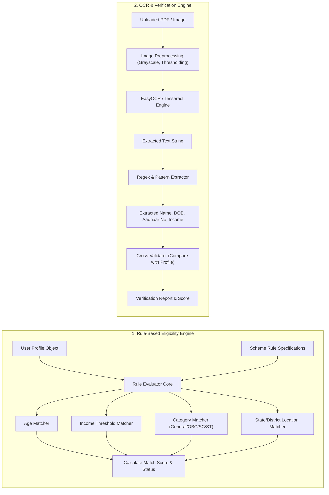
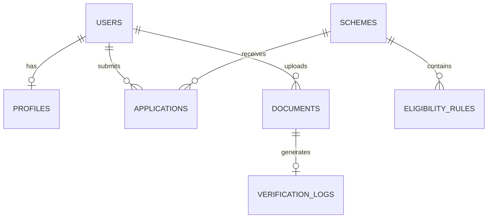

# ARCHITECTURE.md — Eligify

> **Project Name:** Eligify  
> **System Architecture Specification**  
> **Version:** 1.0.0  

---

## 1. Overall System Architecture

Eligify follows a decoupled **3-Tier Architecture** consisting of a React.js Single Page Application (Frontend), a high-performance FastAPI API Gateway/Backend, a specialized Python AI Engine (Rule Evaluator & OCR Document Parser), and a PostgreSQL Relational Database.

### 1.1 Architecture Block Diagram



---

## 2. Module Descriptions

| Module | Location | Primary Responsibilities |
| :--- | :--- | :--- |
| **Frontend UI** | `frontend/` | Renders user registration, profile form, scheme discovery dashboard, eligibility breakdown cards, and document upload wizard. |
| **API Gateway & Auth** | `backend/app/api/` | Handles client requests, user authentication (JWT), request validation (Pydantic), and endpoint routing. |
| **User & Profile Service** | `backend/app/services/` | Manages demographic attributes (age, state, gender, annual income, occupation, category, disability status). |
| **Rule-Based Eligibility Engine** | `ai_engine/rules/` | Evaluates user profile attributes against scheme qualification criteria matrices and generates match confidence scores. |
| **OCR Document Parser** | `ai_engine/ocr/` | Applies image preprocessing, text extraction via OCR, regex pattern matching, and credential verification against claimed profile values. |
| **Database Access Layer** | `backend/app/core/database.py` | Asynchronous connection pooling and ORM models mapping to PostgreSQL tables. |

---

## 3. Data Flow

### 3.1 End-to-End Application Workflow



---

## 4. Backend Architecture

FastAPI serves as the asynchronous backend API layer, structured following clean architecture principles.

```text
backend/app/
├── api/
│   ├── endpoints/
│   │   ├── auth.py         # POST /register, POST /login, GET /me
│   │   ├── users.py        # GET/PUT /profile
│   │   ├── schemes.py      # GET /schemes, GET /schemes/{id}
│   │   ├── eligibility.py  # POST /check, GET /my-recommendations
│   │   └── ocr.py          # POST /upload-verify
│   └── router.py           # Main APIRouter bundling all endpoints
├── core/
│   ├── config.py           # Settings management via pydantic-settings
│   ├── database.py         # SQLAlchemy async engine & sessionmaker
│   └── security.py         # JWT creation, password hashing (bcrypt)
├── models/                 # SQLAlchemy ORM models
├── schemas/                # Pydantic schemas for request/response serialization
└── services/               # Core business services
```

---

## 5. AI Module Architecture

The AI module consists of two decoupled sub-systems: the **Eligibility Engine** and the **OCR Document Verification Engine**.



---

## 6. Database Overview


